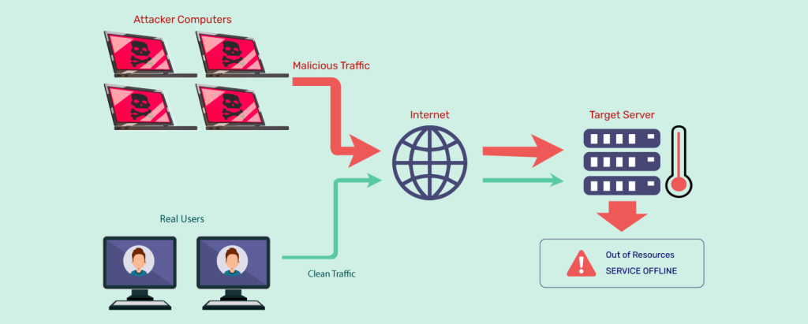
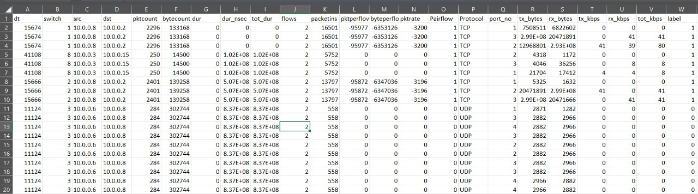
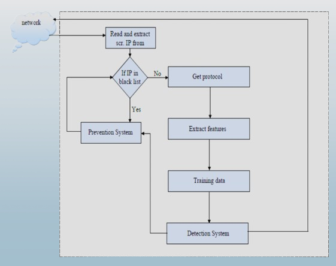
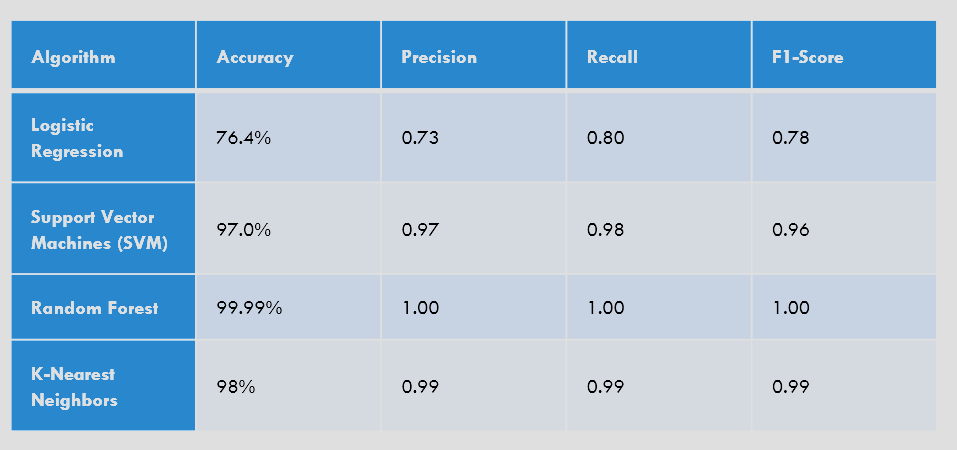
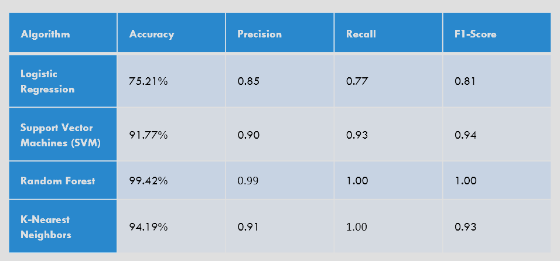

<h1 align = "center"> DDoS Attack Detection using Machine Learning in SDN </h1>

**Contents**

1. [Introduction](#introduction)
2. [Data Analysis](#data-analysis)
3. [Proposed Algorithm](#proposed-algorithm)
3. [Classical ML Models](#classical-ml-models)
4. [Prediction with Feature Selection](#prediction-with-feature-selection)
5. [Conclusion](#conclusion)

<h2 id="introduction"> 📋 Introduction </h2>

This document outlines the process of DDoS (Distributed Denial of Service) attack detection using Machine Learning (ML) techniques in Software-Defined Networking (SDN) environments. 

The goal is to develop models capable of distinguishing between benign and malicious network traffic to enhance network security.

<h2 id="data-analysis">🌟 Data Analysis </h2>

**Dataset Overview**

- The dataset contains information about network traffic, including features like packet count, byte count, protocol, duration, etc.

- The labels indicate whether the traffic is benign or malicious (0 for benign, 1 for malicious).

<h5 id="usage"> 📋 Dataset Parameters </h5>

- `dt`: Timestamp of the event.
- `switch`: Switch ID.
- `src`: Source IP address.
- `dst`: Destination IP address.
- `pktcount`: Count of packets in the flow.
- `bytecount`: Count of bytes in the flow.
- `dur`: Duration of the flow in seconds.
- `dur nsec`: Duration of the flow in nanoseconds.
- `tot dur`: Total duration of the flow.
- `flows`: Number of flows.
- `packetins`: Count of packet insertions.
- `pktperflow`: Packets per flow.
- `byteperflow`: Bytes per flow.
- `pktrate`: Packet rate per second.
- `Pairflow`: Pair flow.
- `Protocol`: Protocol used in the flow (e.g., TCP, UDP).
- `port_no`: Port number.
- `tx_bytes`: Transmitted bytes.
- `rx_bytes`: Received bytes.
- `tx_kbps`: Transmitted kilobits per second.
- `rx_kbps`: Received kilobits per second.
- `tot_kbps`: Total kilobits per second.
- `label`: Label indicating the classification or outcome of the flow.

<h2 id="proposed-algorithm">🌟 Proposed Algorithm </h2>

  

- `Capture Source IP`: Extract the source IP address from network traffic

- `Check Blacklist`:
  - If IP not in blacklist, proceed to identify the communication protocol.
  - If IP is blacklisted, take preventive actions (e.g., block it).

- `Feature Extraction`: Extract relevant features (e.g., packet size, ports) from network data

- `Train ML Model`: Use extracted features to train the machine learning model

- `Detection System`: Analyze incoming traffic using the trained model

- `Classification`: Classify traffic as normal or malicious

<h2 id="classical-ml-models">📋 Results </h2>

**Model Implementation**

- Implemented classical ML models including Logistic Regression, Support Vector Machine (SVM), Decision Tree, Random Forest, and k-Nearest Neighbors (KNN).
- Utilized feature scaling and preprocessing techniques for model training.
- Conducted hyperparameter tuning using GridSearchCV to optimize model performance.

**Observed Results**

- `All Features`

- `Selected Features`

- Logistic Regression, SVM, Decision Tree, Random Forest, and KNN models were trained and evaluated.
- Decision Tree and Random Forest exhibited promising performance in terms of accuracy and classification metrics.

<h2 id="conclusion">✨ Conclusion </h2>

- ML models show promise in detecting DDoS attacks in SDN environments.

- Feature selection and preprocessing techniques play a crucial role in enhancing model performance.

- Decision Tree and Random Forest models demonstrate effectiveness in distinguishing between benign and malicious network traffic.

- Continued research and development in ML-based DDoS detection can contribute to strengthening network security in SDN infrastructures.

<h4 id="usage"> Group 18 Members: </h2>

- **Arihant Garg (21CS01033)**
- **Abeed Shaik (21CS01072)**
- **Priyam Saha (21CS01076)**

Link to GitHub Repository with codes : <a href="https://github.com/ArihantGarg/CN_Project" >GitHub</a>

